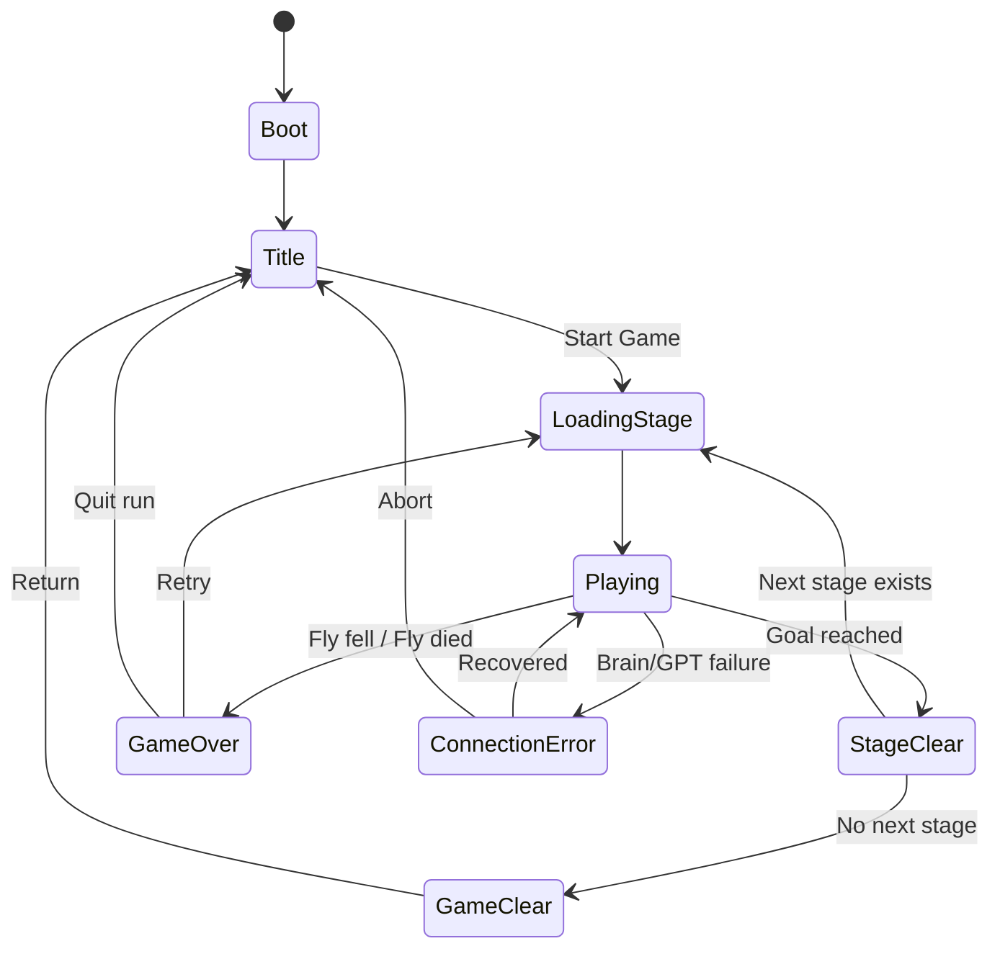

# Flylingual / Blind Sugar Run

## Codex実装用 詳細設計書

対象リポジトリ：

`unagiHuman/Flylingual`

対象Unity：

`Unity 6000.5.5f1`

目的：

**Blind Sugar Runのハッカソン向けVertical Sliceを、既存MaleCNS・GPT Live・物理ハエを壊さず、実際にタイトルからゲームクリアまで遊べるゲームとして成立させる。**

---

# 0. 最優先ルール

作業開始前に必ず以下を読む。

```text
AGENTS.md
Docs/00_START_HERE.md
Docs/Brain-GPTLive-CrossPlatform-Design.md
Docs/windows/Windows-Local-Stack.md
```

既存コードと文書が本設計書と矛盾する場合、

1. 最新ユーザー指示
2. AGENTS.md
3. 共通設計正本
4. 本設計書

の順で優先する。

既存PhysicsRig、CPG、MotorDecoder、MaleCNS dynamicsをステージ都合で変更しない。

ゲームプレイ検証はWindows上の実Brain ServerとのLive接続を使用する。

Replay、固定motor、mockへの自動フォールバックは禁止。

---

# 1. ゲーム全体の体験

ゲームコンセプト：

> プレイヤーにはゲーム世界が見えない。
> 外部視覚脳を接続されたハエには周囲が見える。
> プレイヤーはハエの説明を聞き、会話だけを頼りにハエを砂糖まで誘導する。

身体の移動は必ず、

```text
Player voice
→ GPT / Action Intent
→ Existing 6 Action
→ MaleCNS
→ BrainFrame
→ CPG
→ PhysX Fly
```

を通る。

GPTは身体を直接制御しない。

---

# 2. 技術構成の基本方針

責務を4層に分離する。

```text
┌─────────────────────────────┐
│ Presentation                │
│ UI Toolkit / Audio / FX     │
├─────────────────────────────┤
│ Game                        │
│ GameFlow / Stage / Goal     │
├─────────────────────────────┤
│ Perception & Conversation   │
│ Vision / GPT Live           │
├─────────────────────────────┤
│ Body                        │
│ MaleCNS / BrainFrame / CPG  │
│ Existing PhysX Rig          │
└─────────────────────────────┘
```

上位層は下位層を利用できる。

逆方向の直接参照は避ける。

---

# 3. BlenderMCPの役割

## 結論

ステージの**見た目はBlenderMCPで制作する**。

ただしゲームプレイ判定はUnityで制作する。

BlenderMCPに、

* Kill判定
* Goal判定
* GameFlow
* Raycast sensor
* Gameplay colliderの最終調整

まで持たせない。

---

# 4. BlenderとUnityの責務

## BlenderMCP

担当：

* 机
* 本
* 定規
* 鉛筆
* 紙
* 皿
* 角砂糖
* マグカップ
* 背景
* マテリアル
* UV
* Stage visual composition

Unity側：

* BoxCollider
* Compound Collider
* KillVolume
* GoalVolume
* FlyLandmark
* Observation anchor
* SpawnPoint
* Turn/Planning area
* Level boundary
* Sensor用layer

---

# 5. Unity-first blockout

いきなりBlender完成版から作らない。

最初はUnity primitiveで成立させる。

```text
Cube
Plane
BoxCollider
```

だけで、

```text
Start
→ Ruler
→ Branch
→ Sugar
```

をクリア可能にする。

その後、BlenderMCP visualを被せる。

重要：

**見た目の変更によってPhysics条件が変わらないこと。**

---

# 6. BlenderMCPアセット構成

推奨：

```text
ArtSource/
└─ BlindSugarRun/
   └─ Prototype/
      ├─ BlindSugarRun_Prototype.blend
      ├─ Textures/
      └─ Exports/
```

Unity：

```text
UnityProject/Assets/Flylingual/
└─ Art/
   └─ BlindSugarRun/
      └─ Prototype/
```

Blender原本はArtSource。

UnityへはFBX等のexport結果を入れる。

`.blend`直接依存をゲームビルドの前提にしない。

---

# 7. Blender命名規則

例：

```text
ENV_Desk_VIS
ENV_BlueBook_VIS
ENV_OpenBook_VIS
ENV_Ruler_VIS
ENV_RedPencil_VIS
ENV_SugarPlate_VIS
ENV_SugarCube_VIS
ENV_Mug_VIS
```

Gameplay colliderはUnity側なので、

```text
COL_Ruler
COL_Book
```

をBlenderのvisual meshと混同しない。

必要ならBlender側でproxy referenceを作ってもよいが、
最終ColliderはUnity Inspectorで確認する。

---

# 8. 座標規約

UnityとBlenderのスケールずれを防止する。

基準：

```text
Unity 1 unit = 1 meter
```

Stage root：

```text
Position = 0,0,0
Rotation = 0,0,0
Scale = 1,1,1
```

Import後にStage rootへ0.01等の補正scaleを入れない。

サイズ調整はBlender export前にapplyする。

---

# 9. Codex Skill方針

現在のSkillsとは別に、以下の2つを新設することを推奨する。

```text
Skills/
├─ unity-live-gif/
├─ unity-ui-toolkit/
└─ blender-stage-authoring/
```

---

# 10. unity-ui-toolkit Skill

作成：

```text
Skills/unity-ui-toolkit/SKILL.md
```

最低限記載する。

## UI設計規約

* Runtime UIはUI Toolkit
* UXML = structure
* USS = style
* C# = behavior
* C#だけでUI treeを生成しない
* `UIDocument`を利用
* 共通`PanelSettings`を利用
* 画面ごとにUXMLを分離
* UIから直接SceneManagerを呼ばない
* GameFlowServiceへcommandを渡す
* event callbackはEnable/Disableで対称に管理
* class名とUSS selector命名を統一
* 1920x1080だけに固定しない
* 16:9 / 16:10で破綻しない
* Debug UIとPlayer UIを分離

---

# 11. blender-stage-authoring Skill

作成：

```text
Skills/blender-stage-authoring/SKILL.md
```

記載：

* Unity単位系
* origin規約
* object naming
* transform apply
* export location
* visual only方針
* colliderはUnity
* landmark名
* stage anchor位置
* texture path
* destructive merge禁止
* source `.blend`保持
* export前validation

CodexがBlenderMCPへ依頼する際、このSkillを参照する。

---

# 12. シーン構成

以下の6シーンを作る。

```text
00_Boot
10_Title
20_BlindSugarRun_Prototype
90_StageClear
91_GameOver
92_GameClear
```

ディレクトリ：

```text
UnityProject/Assets/Flylingual/Scenes/
├─ System/
│  └─ 00_Boot.unity
├─ Frontend/
│  ├─ 10_Title.unity
│  ├─ 90_StageClear.unity
│  ├─ 91_GameOver.unity
│  └─ 92_GameClear.unity
└─ Stages/
   └─ 20_BlindSugarRun_Prototype.unity
```

---

# 13. ゲーム全体フロー



---

# 14. 重要：通信障害とGameOverを分離する

以下はGameOverではない。

* Brain disconnected
* GPT API error
* microphone failure
* stale BrainFrame
* protocol error
* Bridge failure

これらを、

```text
ConnectionError
```

として扱う。

AIや通信障害で落下した場合に、

> 「プレイヤーが下手だった」

というゲーム失敗にしてはならない。

---

# 15. GameOver条件

GameOverとなるのはゲーム内事象のみ。

初期実装：

### FALL

KillVolumeへFly rootが入る。

```text
StageKillVolume
```

### DEAD

将来のdeath system用。

```text
IFlyDeathSource
```

を用意してよい。

ただし現時点で死亡mechanicが存在しない場合、
無理にHP systemを追加しない。

Prototypeでは、

```text
落下 = GameOver
```

で十分。

---

# 16. 「落下」の定義

単にY座標が下がっただけではGameOverにしない。

Bridge上の揺れや斜面降下があるため。

GameOver判定は明示的なTrigger Volume。

```text
StageKillVolume
```

を使用。

Stage底面・ステージ外周へ配置する。

---

# 17. Boot Scene

`00_Boot`

目的：

ゲーム全体のpersistent service初期化。

Hierarchy：

```text
00_Boot
└─ AppBootstrapper
```

`AppBootstrapper`は、

```text
GameRoot
```

を生成する。

---

# 18. GameRoot

DontDestroyOnLoad。

Hierarchy：

```text
GameRoot
├─ GameFlowService
├─ GameSessionService
├─ StageCatalogService
├─ ScreenTransitionService
└─ AppLifetimeService
```

既存Brain/GPT runtimeまで無理にGameRootへ移さない。

Brain/GPTクライアントは既存構造を尊重する。

---

# 19. Bootの責務

Bootでは、

* singleton guard
* StageCatalog load
* persistent services初期化
* minimum config validation
* Title scene load

まで。

OpenAI APIへアクセスしない。

Brain simulationを起動しない。

---

# 20. Boot終了

初期化後：

```csharp
LoadSceneAsync("10_Title")
```

相当の非同期ロード。

Boot Scene自身は破棄される。

GameRootだけ残る。

---

# 21. GameFlowService

中心となる状態管理。

概念：

```csharp
public enum AppFlowState
{
    Booting,
    Title,
    LoadingStage,
    Playing,
    StageClear,
    GameOver,
    GameClear,
    ConnectionError
}
```

public API概念：

```text
GoToTitle()
StartNewGame()
RetryCurrentStage()
CompleteStage()
FailStage(reason)
GoToGameClear()
ReportConnectionError(error)
RecoverConnection()
```

UIやStageから直接SceneManagerを呼ばない。

必ずGameFlowService経由。

---

# 22. StageDefinition

ScriptableObject。

```text
StageDefinition
```

フィールド：

```text
stageId
displayName
sceneName
order
```

Prototype：

```text
stageId      = blind_sugar_run_prototype
displayName  = Blind Sugar Run
sceneName    = 20_BlindSugarRun_Prototype
order        = 0
```

---

# 23. StageCatalog

ScriptableObject。

```text
StageCatalog
```

中に、

```text
List<StageDefinition>
```

を保持。

現在は1stage。

将来的には、

```text
Stage 1
Stage 2
Stage 3
...
```

を追加するだけでフローを変えない。

---

# 24. GameSessionService

現在のrun状態を保持。

```text
CurrentStageIndex
CurrentStageId
AttemptCount
LastFailure
RunMemory
```

新規ゲーム時にreset。

GameOver → Retryでは保持。

TitleへQuitしたら破棄。

---

# 25. Retryで記憶を残す

重要。

Blind Sugar Runでは失敗の共有記憶がゲーム性なので、

```text
GameOver
→ Retry
```

でも、

```text
LastFailure
LastFallLocation
LastActionBeforeFall
```

は維持する。

ハエ：

> 「前は定規の右側から落ちたね。」

と言える。

---

# 26. New Game

Titleから、

```text
START
```

すると、

```text
GameSessionService.ResetRun()
```

を行う。

その後Stage 0をロード。

---

# 27. Title Scene

`10_Title`

UI Toolkitのみで制作。

World 3D scene不要。

画面：

```text
THE SUGAR RUN

You cannot see the world.
Your fly can.

[ START ]

[ SETTINGS ]

[ QUIT ]
```

ハッカソンではSettingsは最低限でもよい。

---

# 28. Title開始前Preflight

START押下時、

必要ならローカルruntimeの状態確認。

確認対象：

* Brain reachable
* Bridge reachable
* required config exists

ただしSTART button内にネットワークコードを書かない。

`RuntimePreflightService`等の既存機構があれば利用。

失敗時：

```text
Cannot connect to Neural Link
[Retry]
```

を表示。

GameOverへ送らない。

---

# 29. Stage Scene

`20_BlindSugarRun_Prototype`

Hierarchy：

```text
BlindSugarRun
├─ StageRuntime
├─ Gameplay
│  ├─ SpawnPoint
│  ├─ Goal
│  ├─ KillVolumes
│  └─ Landmarks
├─ Fly
│  └─ ExistingFlyPrefab
├─ Environment
│  ├─ GameplayGeometry
│  └─ VisualGeometry
├─ Sensors
├─ Cameras
└─ UI
```

---

# 30. GameplayGeometry

Unity primitive / collider中心。

```text
GameplayGeometry
├─ StartPlatform
├─ RulerAlignPlatform
├─ RulerBridge
├─ BookPlatform
├─ NarrowRoute
├─ WideRoute
└─ SugarPlatform
```

RendererをOFFにできる構成でもよい。

---

# 31. VisualGeometry

BlenderMCP export。

```text
VisualGeometry
└─ BlindSugarRun_Prototype_VIS
```

GameplayGeometryと完全に同じmeshである必要はない。

ただしプレイヤーにRevealした時に不自然でない程度に一致させる。

---

# 32. Stage Anchors

以下をTransformで明示。

```text
ANCHOR_Start
ANCHOR_RulerEntry
ANCHOR_RulerExit
ANCHOR_Branch
ANCHOR_WideRoute
ANCHOR_NarrowRoute
ANCHOR_Goal
```

Sensorと会話用に利用可能。

---

# 33. Prototypeレベル構造

```text
START
  |
  v
Wide Start Area
  |
  v
Planning Area
  |
  v
Ruler Bridge
  |
  v
Book Platform
  |
  +---- Narrow Short Route
  |
  +---- Wide Safe Route
            |
            v
        Sugar Plate
```

---

# 34. Challenge 1

広いStart。

目的：

* FORWARD
* STOP
* TURN
* Ask Fly

を覚える。

落下可能性なし。

---

# 35. Challenge 2

Ruler Bridge。

最重要難所。

入口を正面から少し角度をずらす。

橋へ入る前に向きを整えないと危険。

橋上でも修正可能だが、難しい。

---

# 36. Challenge 3

Blind Branch。

二択。

```text
Narrow:
short
dangerous

Wide:
long
safe
```

GPTはどちらが正解か知らない。

観測だけ説明。

---

# 37. Goal

Sugar Plateに、

```text
StageGoalVolume
```

を配置。

Goal判定条件：

```text
Fly inside goal
AND
stable for N seconds
```

初期値：

```text
1.0 sec
```

速度threshold等は実測して調整する。

---

# 38. Goal到達時

直ちにStageClear Sceneへ飛ばさない。

まず、

```text
GOAL_PENDING
```

状態。

* motor STOP
* 入力停止
* fly安定確認
* Reveal演出
* Sugar演出

を行う。

その後、

```text
GameFlowService.CompleteStage()
```

---

# 39. Final Reveal

Blind UIを消し、

初めてWorld Cameraを表示。

最も重要な演出の一つ。

流れ：

```text
Goal
↓
Fly: 「あった。」
↓
0.5s pause
↓
Neural HUD fade out
↓
World fade in
↓
camera pull-back
↓
stage全景
↓
Stage Clear
```

---

# 40. StageClear Scene

`90_StageClear`

表示：

```text
STAGE CLEAR

BLIND SUGAR RUN

[ CONTINUE ]
```

GameSessionServiceを見る。

---

# 41. StageClear Continue

```text
if HasNextStage:
    Load next stage
else:
    Load GameClear
```

現在Prototypeは1stageしかないため、

```text
StageClear
→ GameClear
```

となる。

---

# 42. GameClear Scene

`92_GameClear`

表示例：

```text
YOU FOUND THE SUGAR

You couldn't see the world.
But together, you found the way.

[ RETURN TO TITLE ]
```

必要ならクリア後のstage全景背景を使用。

---

# 43. GameOver Scene

`91_GameOver`

表示：

```text
CONNECTION LOST?
```

ではなく、

ゲーム内死因の場合：

```text
YOU FELL

Fly:
「さっきは右側に寄りすぎたみたい。」

[ RETRY ]

[ RETURN TO TITLE ]
```

---

# 44. GameOverへ渡す情報

```text
StageFailureData
```

概念：

```text
reason
stageId
worldPosition
lastAction
lastObservation
attemptNumber
```

---

# 45. StageFailureReason

```csharp
public enum StageFailureReason
{
    Fell,
    Died
}
```

技術障害をここへ追加しない。

---

# 46. UI Toolkitの採用範囲

以下すべてUI Toolkit。

* Title
* HUD
* Subtitle
* Player transcript
* Action status
* Neural Link status
* Pause
* Connection Error
* Stage Clear
* Game Over
* Game Clear

uGUI Canvasを新規導入しない。

---

# 47. UI Asset構成

```text
Assets/Flylingual/UI/
├─ Common/
│  ├─ FlylingualPanelSettings.asset
│  ├─ Theme.uss
│  ├─ Typography.uss
│  └─ Components.uss
├─ Title/
│  ├─ TitleScreen.uxml
│  └─ TitleScreen.uss
├─ Gameplay/
│  ├─ BlindHud.uxml
│  └─ BlindHud.uss
├─ StageClear/
├─ GameOver/
└─ GameClear/
```

---

# 48. UIロジック

各画面：

```text
UXML
USS
Presenter/Controller.cs
```

例：

```text
TitleScreen.uxml
TitleScreen.uss
TitleScreenPresenter.cs
```

Presenterは、

```text
button.clicked
```

をGameFlowServiceへ接続する。

SceneManagerへ直接接続しない。

---

# 49. Gameplay HUD

表示：

```text
FLY NEURAL LINK

FLY:
「右側が近い。」

YOU:
「少し左。」

INTENT:
TURN_LEFT

BRAIN:
MALECNS

LINK:
CONNECTED
```

ただしデバッグ値を大量に見せない。

---

# 50. Blind Mask

Gameplay中はWorldをプレイヤーから完全に隠す。

推奨：

UI Toolkit rootに、

```text
BlindWorldMask
```

を配置。

全画面opaque。

World Cameraは背後で動作してよい。

Reveal時、

```text
BlindWorldMask.opacity
```

をアニメーションして0へ。

---

# 51. Spectator Debug

開発用。

```text
F2
```

等でWorld確認。

Release/Hackathon public modeでは隠すか無効化。

Debug表示時：

```text
DEVELOPER VIEW
```

を明示する。

---

# 52. External Vision

Component：

```text
FlyExternalVisionSensor
```

Fly近傍だけ観測。

利用：

* Raycast
* SphereCast
* Down ray
* Overlap
* Landmark

---

# 53. Observation

```text
FlyWorldObservation
```

最低限：

```text
groundType
slope
leftEdge
rightEdge
forwardObject
forwardDistance
nearbyLandmarks
bodyStable
bodyMoving
```

---

# 54. 外部視覚脳

ゲーム設定：

ハエに後付けされた外部視覚モジュール。

技術構造：

```text
Unity sensors
→ observation
→ GPT Live
→ language
```

MaleCNSがUnity pixelsを処理していると表現しない。

---

# 55. GPTが知ってよい範囲

現在地周辺だけ。

許可：

* 左右edge
* 前方物体
* 近距離platform
* slope
* landmark
* body state

禁止：

* Stage全体map
* Goal shortest path
* hidden route
  -正解route

---

# 56. 移動Action

既存6 Actionのみ。

```text
STOP
FORWARD
TURN_R
TURN_L
FORWARD_R
FORWARD_L
```

新規locomotion commandをprototype都合で追加しない。

---

# 57. Actionと会話

質問：

> 「右はどう？」

Action：

```text
NONE
```

命令：

> 「右向いて。」

Action：

```text
TURN_R
```

会話をActionへ誤変換しない。

---

# 58. Gameplay入力中のルール

ハエが移動中：

返答を短くする。

例：

> 「右が近い。」

> 「まだ止まってない。」

安全地点：

長い相談可。

---

# 59. ConnectionError

Gameplay中にBrain/GPT系が失敗したら、

Blind HUD上にmodal。

```text
NEURAL LINK INTERRUPTED

Movement disabled.

[ RETRY CONNECTION ]
[ RETURN TO TITLE ]
```

出力抑止を維持。

勝手にresumeしない。

---

# 60. Emergency Motor Cut

UIに常設。

```text
EMERGENCY CUT
```

入力：

例 `Space`

動作：

* STOP要求
* new action inhibit
* velocity強制zero禁止
* teleport禁止
* freeze禁止

---

# 61. 音声とUI

Player speech：

```text
Listening...
```

認識：

```text
YOU:
「少し右。」
```

GPT processing：

```text
THINKING
```

Action決定：

```text
INTENT: TURN_R
```

Brain処理：

```text
NEURAL RESPONSE
```

身体動作。

処理段階がプレイヤーに分かるようにする。

---

# 62. StageRuntimeController

Stage sceneに1つ置く。

責務：

* stage start
* spawn
* stage goal
* stage failure
* gameplay enable
* gameplay disable
* goal sequence

GameFlowの全体進行は担当しない。

---

# 63. StageGoalVolume

Trigger。

Fly rootだけを認識。

他colliderや脚が入っただけでclearしない。

Fly root marker：

```text
FlyActorRoot
```

等を用意。

---

# 64. StageKillVolume

Trigger。

Fly root進入で、

```text
StageRuntimeController.Fail(Fell)
```

一度だけ発火。

多重GameOverを防止。

---

# 65. Spawn

```text
StageSpawnPoint
```

をscene内配置。

Stage start時、

既存Fly prefabを指定位置へ置く。

既存PhysicsRigの初期化方法を確認して使用。

Transformを乱暴にteleportしてArticulation stateを壊さない。

---

# 66. Retry

GameOverのRetry：

```text
same StageDefinition
```

を再load。

Stage sceneを再利用。

前stage instanceを使い回さない。

これによりphysics状態を完全に初期化。

RunMemoryだけpersistent。

---

# 67. Scene load

GameFlowServiceのみがscene load。

概念：

```text
FadeOut
↓
LoadSceneAsync
↓
SceneLoaded
↓
FadeIn
```

多重loadをguard。

---

# 68. ScreenTransition

`ScreenTransitionService`

persistent。

UI Toolkitまたは専用overlay。

Scene transition中：

```text
input disabled
```

---

# 69. Stage progression

StageCatalog：

```text
[0] BlindSugarRunPrototype
```

将来：

```text
[0] Desk
[1] Books
[2] Window
...
```

追加してもGameFlow変更不要。

---

# 70. Prototype memory

GameSessionService：

```text
AttemptMemory
```

保持：

```text
lastFallArea
lastAction
attemptCount
```

Retry時にConversationへ渡す。

---

# 71. BlenderMCP制作順

Codexは以下の順で行う。

### Step A

Unity primitive blockout。

### Step B

実Flyで通行テスト。

### Step C

GameplayGeometry寸法をlock。

### Step D

寸法情報をBlenderMCPへ渡す。

### Step E

Blender visual制作。

### Step F

Unity import。

### Step G

GameplayGeometryへvisualを重ねる。

### Step H

Reveal cameraで見た目確認。

この順番を逆にしない。

---

# 72. Visual quality

ハエ視点の世界なので日用品を巨大に見せる。

重点：

* realistic ruler
* paper fiber
* book cover
* sugar crystal
* cup
* desk scratches
* dramatic depth

ただしプレイ中は見えない。

**Goal Revealで一気に見せるための美術**として作る。

---

# 73. Reveal camera

専用：

```text
GoalRevealCamera
```

Timeline使用可。

流れ：

```text
close fly
→ sugar
→ pull back
→ ruler
→ books
→ start point
```

10秒以内。

---

# 74. Boot/Title UIの美術方向

テーマ：

```text
laboratory neural terminal
```

ただし安価なSF HUDにしすぎない。

黒背景＋最小限。

視覚言語：

* neural pulse
* thin lines
* typography
* fly waveform

---

# 75. Gameplay HUD

画面中央をUIで埋めない。

会話が最重要。

優先順位：

```text
Fly speech
Player speech
Action
Connection
```

developer dataは隠す。

---

# 76. Codex作業分割

AGENTSに従い、まとまった作業はサブエージェントへ分離。

推奨：

### Agent A

GameFlow / scene transition

### Agent B

UI Toolkit assets

### Agent C

Prototype stage / gameplay geometry

### Agent D

External Vision

### Agent E

BlenderMCP visual

### Agent F

Integration validation

同一ファイルの同時編集は禁止。

Unity Editor操作担当は同時に1名。

---

# 77. 実装フェーズ1

## GameFlow foundation

作る：

* AppBootstrapper
* GameFlowService
* GameSessionService
* StageDefinition
* StageCatalog
* ScreenTransitionService
* Scenes 6種

まだBrain/GPTに触らない。

Gate：

```text
Boot
→ Title
→ Stage
→ StageClear
→ GameClear
```

dummy buttonで動く。

さらに：

```text
Stage
→ GameOver
→ Retry
```

も動く。

---

# 78. 実装フェーズ2

## UI Toolkit

全sceneへUI。

Gate：

マウスだけで、

```text
Boot
Title
Gameplay
GameOver
Retry
StageClear
GameClear
Title
```

が通る。

---

# 79. 実装フェーズ3

## Gameplay Stage

Primitive blockout。

Goal / Kill。

既存Fly。

Gate：

Developer viewで手動操作し、

Start → Sugar

へ到達可能。

---

# 80. 実装フェーズ4

## Real Brain

Windows Brain live。

経路：

```text
Unity
→ 127.0.0.1:18766
→ BrainFrame
→ Fly
```

Gate：

* sequence
* stale 0
* protocol error 0
* expected movement

を確認。

---

# 81. 実装フェーズ5

## External Vision

Sensor実装。

Developer HUDで、

```text
LEFT EDGE
RIGHT EDGE
FORWARD OBJECT
LANDMARK
```

を検証。

---

# 82. 実装フェーズ6

## Blind Play

Player World Viewを隠す。

まずGPTなし。

rule-based textでもよい。

Blind HUDだけでStage clear可能か確認。

---

# 83. 実装フェーズ7

## GPT Live

ObservationをGPTへ。

Player voice → Action。

既存Bridge設計を優先。

API keyをUnity assetへ書かない。

---

# 84. 実装フェーズ8

## BlenderMCP

Gameplay成立後にvisual制作。

Reveal完成。

---

# 85. 実装フェーズ9

## Memory

Fall記憶。

Retry時の1回だけの参照。

---

# 86. 実装フェーズ10

## Final polish

* sound
* fade
* neural FX
* title
* sugar animation
* game clear

---

# 87. テストマトリクス

最低限以下を確認。

### Flow

```text
Boot → Title
Title → Stage
Stage → GameOver
GameOver → Retry
GameOver → Title
Stage → StageClear
StageClear → GameClear
GameClear → Title
```

### Brain

```text
Live connection
BrainFrame sequence
STOP
FORWARD
TURN_L
TURN_R
```

### Safety

```text
disconnect
stale
GPT timeout
```

### Gameplay

```text
fall
goal
retry
blind clear
```

---

# 88. GameFlow acceptance

合格条件：

Boot起動時に他scene依存なし。

Title STARTでStageへ。

FallでGameOver。

Retryで同stage。

GoalでStageClear。

StageCatalogに次がなければGameClear。

GameClearからTitle。

scene load多重発火なし。

---

# 89. UI acceptance

* 1920×1080正常
* 16:10で破綻しない
* keyboard操作可
* mouse操作可
* speech字幕表示
* Blind Mask完全opaque
* Developer Viewでworld表示
* Releaseではdeveloper toggle非表示

---

# 90. Stage acceptance

Developer viewで、

既存6 Actionのみを使用して、

```text
Start
→ Ruler
→ Branch
→ Sugar
```

を完走可能。

Collider由来の不自然な引っ掛かりなし。

---

# 91. Blind acceptance

World映像なしで、

ハエの説明だけから、

Start → Sugar

を最低1回クリア。

これがゲームとしての最重要Gate。

---

# 92. Conversation acceptance

質問：

> 「右は？」

身体を動かさない。

命令：

> 「右向いて。」

TURN_R。

不明：

> 「あそこ行こう。」

勝手に動かず確認。

---

# 93. Failure acceptance

落下：

GameOver。

Retry：

同stage。

前回落下記憶保持。

通信障害：

GameOverにならない。

---

# 94. Blender acceptance

* scale 1
* origin正常
* missing textureなし
* visual/collider分離
* physics変更なし
* Revealで見栄え成立

---

# 95. ハッカソンMVP

最終的に必須なのは以下。

```text
Boot
Title
Start
Real MaleCNS
Voice
Blind HUD
External Vision
Ruler Bridge
Branch
Fall
GameOver
Retry
Sugar
Reveal
Stage Clear
Game Clear
```

---

# 96. 後回し

今回追加しない。

```text
Save Game
Multiple profiles
Achievements
Inventory
HP system
Flying
Jump
Wall walking
Procedural level
GPT Vision image recognition
Full biological vision simulation
Online multiplayer
Long-term personality evolution
```

---

# 97. Codexへの開始指示

まず実装を始める前に、

1. 現在のUnity Assets構成を調査
2. 既存scene一覧を確認
3. 既存GameFlow相当コードを検索
4. 既存UI Toolkit利用有無を検索
5. 既存Brain/GPT componentを特定
6. AGENTSの禁止事項を確認

する。

既に存在する機能を重複実装しない。

その結果を基に実装計画を確定する。

---

# 98. 最初のCodex実装タスク

最初のcommitではBrain/GPT/Blenderを触らない。

実装範囲：

```text
GameFlow foundation
+
UI Toolkit basic screens
+
empty prototype scene
```

完成条件：

```text
Boot
→ Title
→ Prototype
→ StageClear
→ GameClear

Prototype
→ GameOver
→ Retry
```

がEditor上で成立する。

---

# 99. 2回目のCodexタスク

Prototype sceneへGameplayGeometryを追加。

Goal / Kill / Spawn。

既存Flyを配置。

Developer Viewでクリア可能にする。

---

# 100. 3回目以降

その後初めて、

```text
Real Brain
External Vision
Blind HUD
GPT Live
BlenderMCP
```

を順次統合する。

---

# 101. 最終完成状態

ゲーム起動。

Boot。

Title。

プレイヤー：

```text
START
```

暗いNeural Link画面。

ハエ：

> 「聞こえる？」

プレイヤー：

> 「聞こえる。前はどうなってる？」

ハエ：

> 「細い板がある。少し右向き。」

プレイヤー：

> 「右を向いて。」

MaleCNSが処理。

ハエが実際に旋回。

プレイヤーは一度落ちる。

Game Over。

Retry。

ハエ：

> 「前は板の右側から落ちたね。」

再挑戦。

砂糖へ到達。

ハエ：

> 「あった。」

Neural UIが消える。

初めて世界が見える。

巨大な机、本、定規、皿、そして小さなハエ。

Stage Clear。

Continue。

残るStageなし。

Game Clear。

これをBlind Sugar Run Prototypeの完成定義とする。
