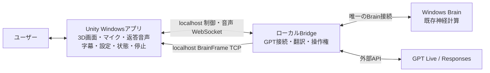

# Unityで完結するハエリンガル会話：移行プラン

2026-09-12。調査対象 main `a9c15a1`。本書は実装計画であり、受入れ済みの記録ではない。後続のユーザー指示で実装へ着手した。現在の使い方・制限は [利用手順](Unity-Native-Conversation-Usage.md)、実測は別の検証記録に分ける。

## 1. 到達点

ユーザーが操作するアプリをWindows Unity Playerに一本化する。Unity画面内でハエを見る、マイクを選ぶ、話しかける、返答を聞く、字幕と状態を見る、設定を変える、停止する、という一連の操作を完結させる。ブラウザ、WebView、映像のWebRTC往復、映像配信サービスを通常起動の必須要素から外す。

「Unityへ集約」は、画面・音声・操作と起動管理をUnityアプリへ集約する意味とする。既存のPython Brain／Bridgeは同じWindows PCの内部プロセスとして再利用する。BrainとGPT接続までC#へ全面移植することは初期移行に含めない。この分担なら既存の神経計算・API実装を保ちつつ、ユーザーにはUnityだけを見せられる。GPT Live／Responsesへのインターネット接続は引き続き必要。

図の制御WebSocketとBrainFrame TCPは別経路を維持する。UnityはBrainへ直接接続せず、両方とも同居Bridgeへ接続する。WebRTCを除去しても、このlocalhost通信と外部API通信は残る。

## 2. 現物確認と変更範囲

| 対象 | 現状 | 移行方針 |
|---|---|---|
| Unity 3D／身体 | 実描画、LiveTcp受信あり | 維持。Unity画面をそのまま表示 |
| `Runtime/Player/app.js` / `core.js` | 会話開始、設定、字幕、操作権、停止のブラウザ状態管理 | Unityの独立した会話コントローラーと画面へ移植 |
| `Runtime/Player/audio.js` | マイク収録、24kHz PCM変換、返答再生、音声診断 | Unityのマイク／再生アダプターへ置換 |
| `Runtime/Bridge/` | GPT Live、Responses、意図翻訳、Brain接続、排他、安全停止 | 再利用。会話専用モードに必要な契約だけ追加検討 |
| `BrainTcpClient` / `BrainMotorSource` | Unity側の既存motor受信 | 維持し、会話側の制御断でも独立に出力を抑止 |
| `Runtime/Video/` / `UnityVideoPublisher` | Unity画面をブラウザへ転送 | Unity会話モードでは起動／有効化しない。遠隔閲覧用コードは保持 |
| `tools/windows_local.py` | Brain・Bridge・Video・Unityを一括起動 | Unity会話用の起動経路を追加。Videoとブラウザを要求しない |

今回確認したUnity Assetsには会話用WebSocketクライアント、Microphone収録、返答AudioSource実装が見当たらない。`Packages/manifest.json` はaudioモジュールを明示していないため、実装初期にAudioとUIの必要モジュールを確認・追加し、Windows Playerで検証する。現行6000.5.5f1を維持し、UI基盤はUI Toolkitを第一候補とする。WebViewへのHTML埋込みは採用しない。

## 3. Unity側の構成

新規コードは原則 `UnityProject/Assets/RuntimeIntegration/Conversation/` に分離する。既存ゲームスクリプトへ音声・通信処理を大量に追加しない。

| 部品（仮称） | 責務 |
|---|---|
| `BridgeControlClient` | 単一WebSocket、分割受信の組立て、サイズ上限、送信直列化、取消し、切断通知 |
| `ConversationSessionController` | 会話と操作の状態遷移、開始／終了、epoch・session・設定revisionの照合 |
| `UnityMicrophoneCapture` | 入力デバイス列挙、明示開始、録音位置監視、環状バッファ読出し、入力レベル |
| `PcmStreamConverter` | 入力実サンプルレートから24kHz mono PCM16 little-endianへ変換、100ms単位の送信 |
| `UnityReplyAudioPlayer` | PCM受信、出力レートへの変換、上限付き再生バッファ、中断、実再生位置の計測 |
| `ConversationView` | マイク選択、会話開始／終了、押して話す、字幕、返答音量、声・言語・話し方、緊急停止 |
| `ConversationDiagnostics` | 状態、フレーム鮮度、音声レベル、送受信数、キュー長、遅延、エラーコードを集約 |

WebSocketは.NET `ClientWebSocket`を第一候補とし、初期段階でWindows Editor／実Player両方の動作を確認して採用確定する。既存BridgeのJSON/base64契約を最初は保持し、新しい音声プロトコルや別の音声接続を増やさない。UI更新はメインスレッドへ集約し、音声コールバックから通信・JSON解析・ファイルI/O・重い割当てを行わない。

映像はUnityカメラから直接表示する。録画・配信モジュールが無効でも会話アプリの起動とテストが通ることを必須にする。

## 4. 会話と身体操作を分ける

現在のブラウザの開始フローは、新しいSTOPの適用と新鮮なBrainFrameを待ち、GPT操作権を取得して再開した後にマイクを開始する。Brainの750ms超過が音声確認まで止めるため、このまま移植するだけではテストしにくさが残る。

**会話のみ**を既定の動作モードにする。Unityで実マイク→実GPT→返答音声・字幕を確認する間、身体出力を抑止し、行動要求をBridge側でも実行しない。Brainが未接続／staleでも一般的な会話と音声機器の確認を可能にし、脳に関する説明は「観測なし／古い観測」と明示する。偽のBrainFrameや仮のmotorは作らない。

**会話＋行動**は「声で操作を有効にする」という別の明示操作で有効にする。Unityは会話を停止し、`nativeVoiceControl`／`control` の新sessionを要求する。Bridgeが `owner=gpt` と safety STOP を適用し、fresh STOP＋live＋`voiceControlAvailable` を確認した後にだけ明示 `resume` を送る。その後 Unity は localhost Bridge motor TCP で既存 BrainMotorSource／locomotion へ接続する。GPTは6 Actionを提案し、既存のBrain、raw神経出力、decoder、motor経路を通る。動作中にstale、TTL切れ、epoch更新、制御断が起きた場合は身体を即時抑止し、明示再開まで保持する。

これは**新規設計部分**であり、既存の`conversation.mode=live`や`owner=observer`を選ぶだけで完成するとは扱わない。現在は音声入力に`controlEpoch`が必要で、`inhibit()`が旧音声／意図を無効化する。初期段階で次を契約化する。

- 会話セッションの世代と身体操作のepochを分けて管理し、どの状態で収録・再生・Actionが許可されるかを表にする。
- 会話のみではdelegationやテキストからの行動実行をBridgeで拒否する。UIのボタン無効化だけに依存しない。
- Brain identity変更・古い観測に基づく未完了発話やActionは破棄する。身体停止と一般会話の終了を同一扱いにしない。
- 制御WS断・会話終了・アプリ終了ではマイクと再生キューを解放する。身体の再開は自動化しない。
- 追加能力はcapability／versionで通知する。旧ブラウザクライアントは従来の保守的な停止動作を維持する。

会話の入力・返答時には非物理の色pulseを表示できるが、神経由来の感情や身体反応とは区別する。設定・診断画面には文字指示欄を置き、音声と同じintent経路へ送る。画面では指示受付、Brain適用、神経応答、Unityの実身体観測を別々に示す。ミュートは音声だけを止め、身体停止は緊急停止とする。

`ready=false`は受信値のまま表示し、会話成功でtrueへ昇格させない。750msの制限を緩めることはこの移行に含めず、計算遅延の改善は別課題として扱う。

## 5. 音声をテストしやすくする方針

初版は**常時マイク＋ヘッドセット**を標準にする。GPT Liveの双方向通話中は返答再生中もマイクを収録・送信する。AECは未実装で、同時送受信はエコー自動除去を意味しない。割込み発話の実機品質は未検証とする。

UnityのマイクAPIへ置き換えても、Windows側のマイク許可、機器占有、デバイス切断、実サンプルレート、エコーは残る。ブラウザに要求していたecho cancellation／noise suppressionと同等の処理がUnityで自動的に得られるとは仮定しない。スピーカーでの同時通話や割込み発話は後段の別受入れにする。

入力はデバイス名だけでなく録音位置の進行を監視し、「開始API成功だが音が来ない」を区別する。44.1/48kHz等の実入力を24kHzへ変換し、出力も実際のミキサーレートに合わせる。無音、バッファ枯渇、過剰蓄積、切断直後の古い音声について明確な処理を定める。

Unityの[Microphone.GetPosition](https://docs.unity3d.com/6000.0/Documentation/ScriptReference/Microphone.GetPosition.html)は録音バッファのサンプル位置を返すため、入力の進行確認に利用する。[OnAudioFilterRead](https://docs.unity3d.com/6000.0/Documentation/ScriptReference/MonoBehaviour.OnAudioFilterRead.html)はメインスレッドと別の音声スレッドで呼ばれるため、再生アダプターの責務を分離する。6000.5.5f1での採用可否は実装時に実Playerで確かめる。

## 6. 起動・終了・配布

開発中はUnity Editorの専用会話テストSceneを用意し、ゲーム本体へ統合する前に同じコンポーネントを確認できるようにする。Play Mode終了、Domain Reload、Scene再読み込みによる二重WS、二重AudioListener、孤立したマイクを防ぐ。

最終的な利用開始はUnity Playerを1つ起動するだけにする。Unityの起動管理が同居Bridge／Brainを起動し、必要な依存と設定の検査結果をUnity内へ表示する。Python環境・データ・APIキーファイルは同じWindows内の設定で解決し、キー内容はC#のSerializedField、Scene、ビルド資産へ埋め込まない。既存サービスの無条件流用や一括killはせず、所有したプロセスだけを終了する。

初期段階は既存Python環境を再利用する。配布パッケージへPython実行環境とデータ参照をまとめる工程は、音声受入れ後の段階とする。Brain／Bridgeまで同一OSプロセスへ変換することと、Unityアプリから起動を完結させることを区別する。

GPTとのprimary WebSocket接続とプロジェクトAPIキーの保持はBridgeに残す。この構成は、サーバーがクライアント音声を中継する用途についての[OpenAI公式WebSocketガイド](https://developers.openai.com/api/docs/guides/voice-websockets)とも整合する。現在のGPT Live／Responsesモデルをこの移行だけで変更しない。

## 7. 実装順と各段階の完了条件

| 段階 | 実装内容 | 完了条件 |
|---|---|---|
| 1. 通信と状態の土台 | 制御WS、会話のみの契約、診断表示、Audio/UI依存の確認 | Editor／Playerで接続・設定revision・切断を確認。動作権なし、古いepoch拒否、二重WS拒否が働く |
| 2. 返答音声と字幕 | 受信PCM、再生バッファ、字幕、停止／破棄 | 実APIの返答をUnityで聞ける。停止後に古い返答が再生されない |
| 3. マイク会話 | デバイス選択、入力レベル、常時収録・変換、会話のみモード | Windows実マイクと実APIで10往復。身体を停止したまま、入力・認識・返答・再生の失敗箇所を特定できる |
| 4. 実脳・身体との統合 | 明示的な会話＋行動、緊急停止、脳要約、既存身体接続 | Windows実Brainで6 Action各3回の受付／適用／新規frameを記録。stale・断線で抑止、無断再開なし。神経妥当性／移動品質の認定とは分ける |
| 5. Unity単独起動 | 起動管理、ゲーム画面への統合、Video/ブラウザ依存の除去 | ブラウザ・映像サービス停止状態でUnity起動から会話終了まで完結。起動終了5回と15分継続で資源残留・音声蓄積を確認 |
| 6. 話しやすさの改善 | 自動音声検出、スピーカー、必要な場合だけエコー対策 | 初版の測定と比較し、誤認識・自己音声の再入力・中断の問題を個別に評価 |

段階1〜3を最小の会話版とする。ゲームScene全面改修、神経モデル変更、物理調整を同時に進めない。各段階が完了してから次へ進み、実測を得る前に会話遅延や工期を保証しない。

## 8. 検証と証拠

- PCM変換、リングバッファ、JSON組立て、状態遷移は純粋ロジックのテストで分離する。音声用の既知サンプルは音声部品の検査に限り、偽Brainや固定motorによる身体試験へ流用しない。
- Unity動作・統合はWindows上の実BrainへLiveTcp接続して実施する。マイク／音声の独立試験では身体を動かさない。
- Windows Editorと実Playerを別々に確認する。Player UIを操作ツールが取得できない場合、実操作を成功扱いにせず、人による押して話す／開始／停止の確認を記録する。
- 最小の障害項目は、マイクなし／使用不可／抜差し、無音、API認証失敗・接続断、Brain stale、Bridge終了、二重起動、会話中の設定変更、Play Mode／アプリ終了。
- Unityの同じ単調時計で入力終了→送信、入力終了→最初の返答再生を測り、キュー深さ、欠落、再生中断、中央値・p95・最大値と母数を残す。サーバー間の時計を直接減算しない。
- Brain identity、ready、sequence、epoch、Actionの受付と適用、step時間、ソース・設定・データhash、RSSを別に記録する。字幕／PCMの常時保存は既定で無効にし、APIキーは記録しない。

## 9. 変更予定ファイルと進め方

主な追加先は上記Unity Conversationフォルダ、会話UI／専用テストScene、Editor起動補助。変更候補は `Runtime/Bridge/server.py`・`conversation.py`、`Contracts/bridge-v1/protocol.md`、Unity `Packages/manifest.json`、`tools/windows_local.py` と起動設定。Browser／Videoコードは初期移行で削除しない。

実装時は「Unity音声・UI」「Bridgeの契約拡張」「統合検証／起動管理」に担当を分ける。各ファイルと各実行プロセスの担当を一人にし、主担当が差分・生ログ・受入れ条件を確認する。計画作成後のユーザー指示に基づいて実装・ビルド・実API検証を進める。実装したことを受入れ完了とは扱わない。

参照正本：[共通設計ルール](../Brain-GPTLive-CrossPlatform-Design.md)、[Bridge契約](../../Contracts/bridge-v1/protocol.md)。本書の会話専用モードなど、現在の実装と異なる箇所は新規提案として扱い、実装段階で正本と契約を併せて更新する。
